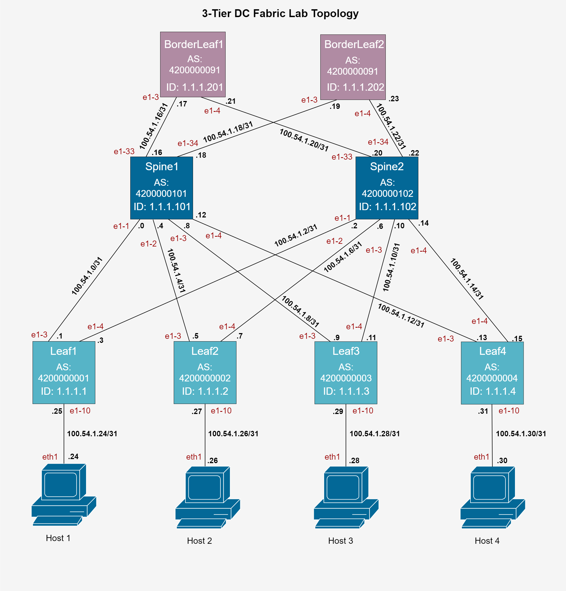

# clab-dc1
Leaf and spine network with containerized SRLinux nodes

Basado en: [Configuring SRLinux Nodes in a 3-Tier Data](https://networkcloudandeverything.com/configuring-srlinux-nodes-in-a-3-tier-data-center/)




## Deploy
```bash
sudo containerlab deploy -- my_dc1.yaml
```

## Conectarse a los nodos
Default credentials: admin:NokiaSrl1!
### ssh
```bash
ssh admin@<container-name/id>
```

### ssh IPv4:
```bash
ssh -4 admin@<container-name/id>
```

### docker
```bash
docker exec -it <container-name/id> bash
```


