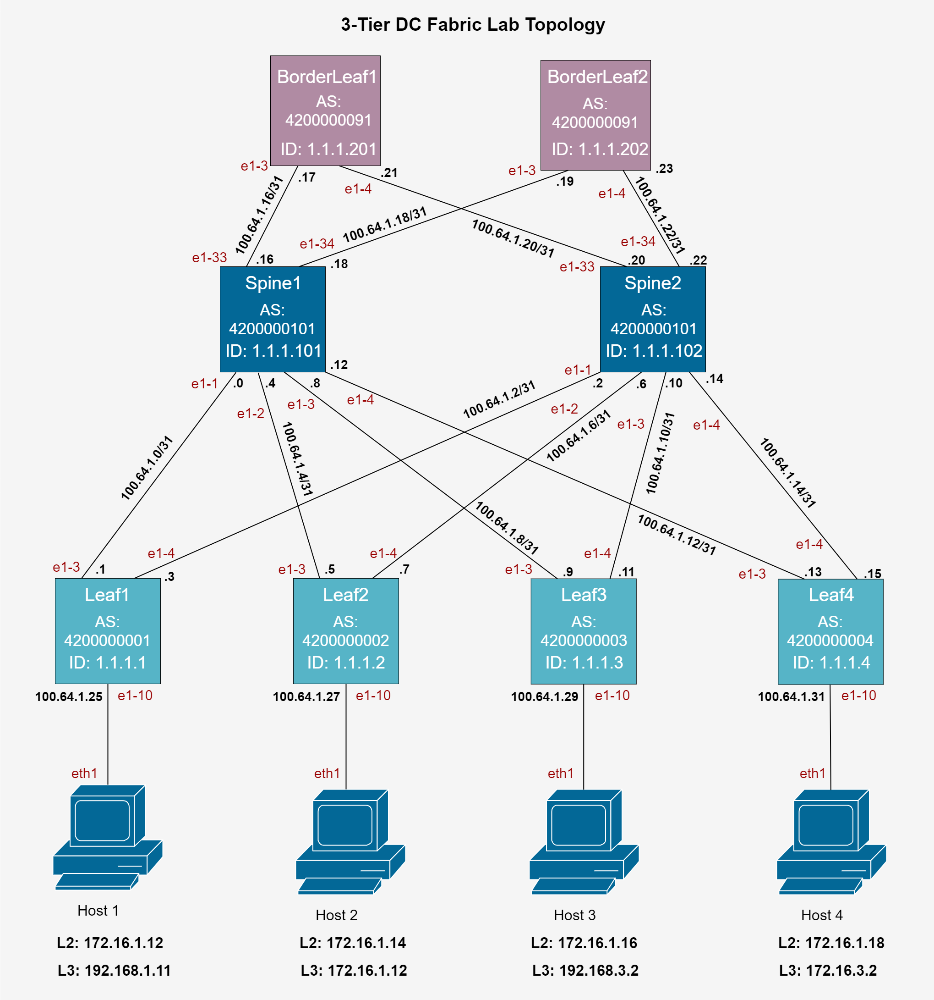

# clab-dc1
Leaf and spine network with containerized SRLinux nodes

Basado en: [Configuring SRLinux Nodes in a 3-Tier Data](https://networkcloudandeverything.com/configuring-srlinux-nodes-in-a-3-tier-data-center/)




## Deploy
```bash
sudo containerlab deploy -t my_dc1_ip.clab.yml
```
```bash
sudo containerlab deploy -t my_dc1_mac.clab.yml
```

## Cargar configuración
```bash
bash setup.sh ip
```
```bash
bash setup.sh mac
```

## Destroy
```bash
sudo containerlab destroy -t my_dc1_ip.clab.yaml
```
```bash
sudo containerlab destroy -t my_dc1_mac.clab.yaml
```

## Conectarse a los nodos
Default credentials: admin:NokiaSrl1!
### ssh
```bash
ssh admin@<container-name/id>
```

### ssh IPv4:
```bash
ssh -4 admin@<container-name/id>
```

### docker
```bash
docker exec -it <container-name/id> bash
```

## Comandos SR-Linux
### Ver lo que está configurado
```bash
info flat
```
### Interfaces
```bash
show interfaces
```

### OSPF
#### Vecinos OSPF
```bash
show network-instance default protocols ospf neighbor
```

#### Area database
```bash
show network-instance default protocols ospf database
```

### BGP
#### Vecinos BGP
```bash
show network-instance default protocols bgp neighbor
```
#### Rutas
```bash
show network-instance default protocols bgp routes ipv4 summary
```
#### Rutas recibidas
```bash
show network-instance default protocols bgp neighbor <ip> received-routes <ipv4/ipv6/evpn>
```
#### Rutas anunciadas
```bash
show network-instance default protocols bgp neighbor <ip> advertised-routes <ipv4/ipv6/evpn>
```


## Gráfica de la topología
```bash
sudo containerlab graph -t <archivo .yml>
```
```bash
containerlab graph --topo my_dc1.yaml --dot
```
y después visualizarla en [Graphviz](https://dreampuf.github.io/GraphvizOnline/#digraph%20G%20%7B%0A%0A%20%20subgraph%20cluster_0%20%7B%0A%20%20%20%20style%3Dfilled%3B%0A%20%20%20%20color%3Dlightgrey%3B%0A%20%20%20%20node%20%5Bstyle%3Dfilled%2Ccolor%3Dwhite%5D%3B%0A%20%20%20%20a0%20-%3E%20a1%20-%3E%20a2%20-%3E%20a3%3B%0A%20%20%20%20label%20%3D%20%22process%20%231%22%3B%0A%20%20%7D%0A%0A%20%20subgraph%20cluster_1%20%7B%0A%20%20%20%20node%20%5Bstyle%3Dfilled%5D%3B%0A%20%20%20%20b0%20-%3E%20b1%20-%3E%20b2%20-%3E%20b3%3B%0A%20%20%20%20label%20%3D%20%22process%20%232%22%3B%0A%20%20%20%20color%3Dblue%0A%20%20%7D%0A%20%20start%20-%3E%20a0%3B%0A%20%20start%20-%3E%20b0%3B%0A%20%20a1%20-%3E%20b3%3B%0A%20%20b2%20-%3E%20a3%3B%0A%20%20a3%20-%3E%20a0%3B%0A%20%20a3%20-%3E%20end%3B%0A%20%20b3%20-%3E%20end%3B%0A%0A%20%20start%20%5Bshape%3DMdiamond%5D%3B%0A%20%20end%20%5Bshape%3DMsquare%5D%3B%0A%7D)


